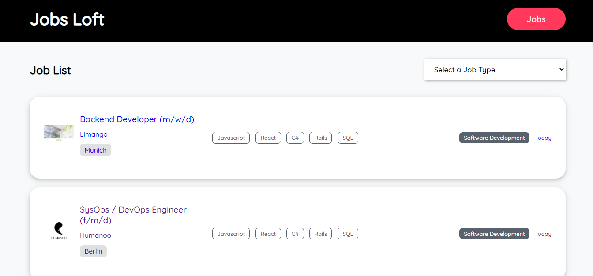
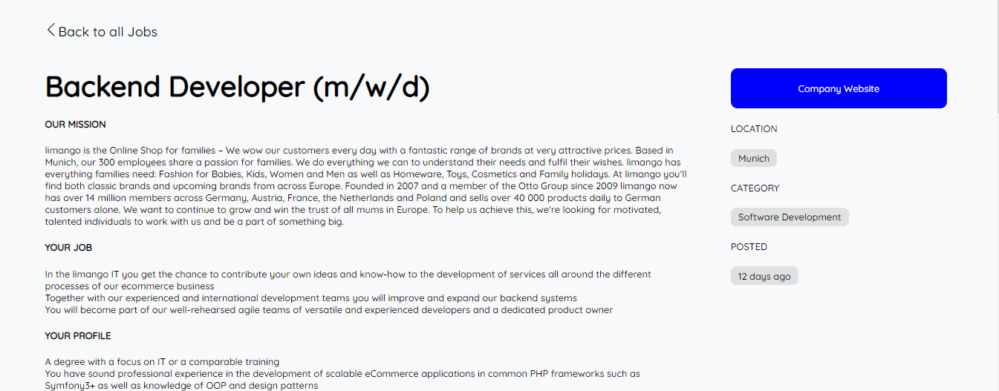

# Jobs Loft 
> Job Loft  is a simple application created to give software enginneering jobs seekers access to the most recent job listings.

 ;
 ;
 

## Live Link
   [See it live here](https://job-loft.herokuapp.com/)

## Built With

- React
- SCSS

## Getting Started

To get a local copy up and running follow these simple example steps.

### Setup

1.  Clone this repository with
    `git clone https://github.com/Maryjanee/Jobs-loft.git` using your terminal or command line.
2.  Change to the project directory by entering `cd Jobs-Loft` in the terminal
3.  Next open run `npm i` to install necessary packages and dependencies.
4.  Once the installation is complete run `npm start` to start the application.

## Author

👤 **Maryjane Akpagbue**

- Github: [Maryjane Akpagbue](https://github.com/Maryjanee)

## Show your support

Give a ⭐️ if you like this project!

## Acknowledgments

- Microverse
